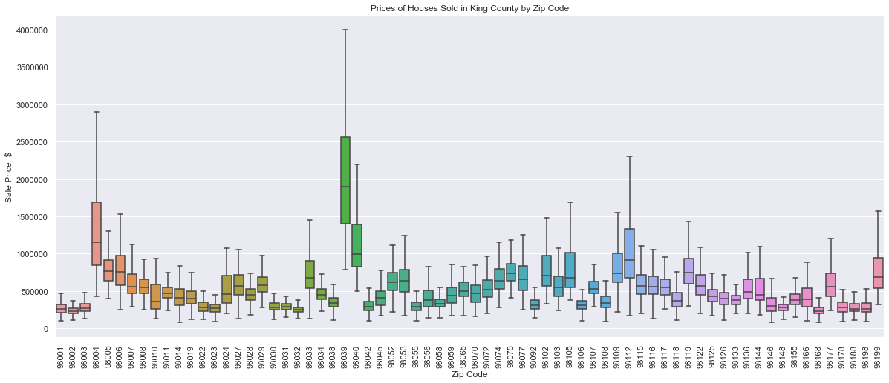
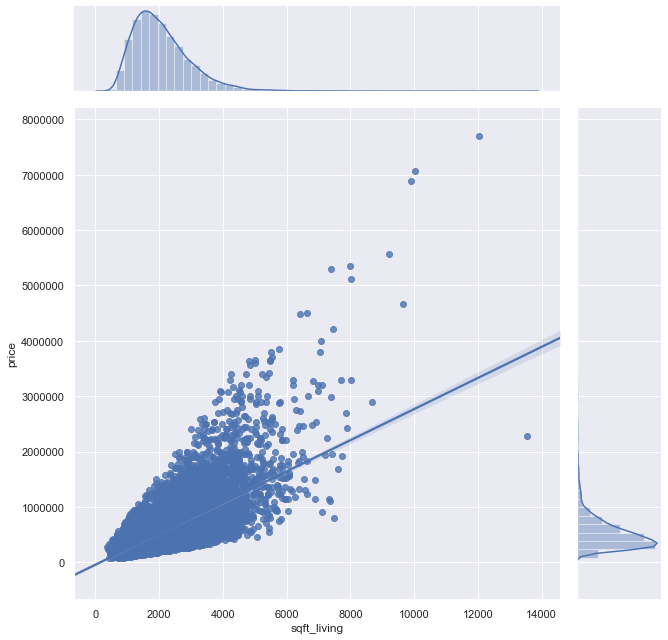
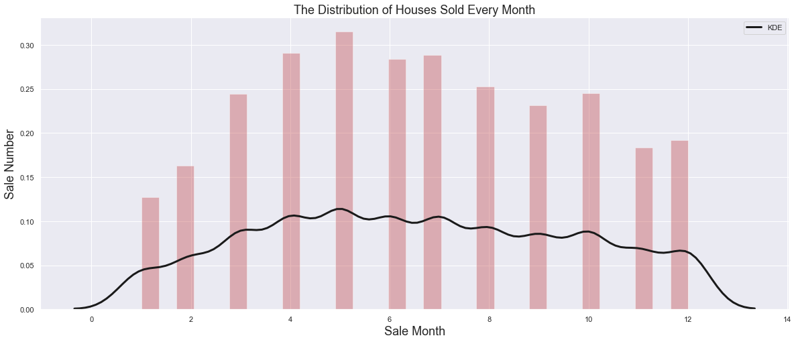

# Module 2 Final Project

## Introduction

In this project, a multiple linear regression model is constructed to predict the price of a house according to given parameters. Three important question about housing are asked in the beginning and answered at the end of the project.
## Questions

* What are the key factors to predict the price of a house? (For real estate agents)

* What is the most important factor determining the value of a house?(For home buyers)

* How can a house's value be increased?(For home sellers)

## OSEMN Approach
The model is constructed according to OSEMN approach which is;

1 - Obtaining the data 2 - Scrubbing the data 3 - Exploring the data 4 - Modeling the data 5 - iNterpreting the results

## The Dataset

For this project, the King County House Sales dataset is used. The dataset can be found in the file `"kc_house_data.csv"`, in this repo.

The description of the column names can be found in the column_names.md file in this repository. 

## The Process 

 The data is cleaned, the null values are solved, some data types are changed, stantardizations, normalizations and logarithmic transformations are made. 
 
 Normality, linearity and multicollinearity are checked. Visualisations are made. Baseline model is constructed. Model is refined again and again using many methods including normality check with q-q plots, homoscedasticity check with scatter plots of residuals, multicollinearity check with Variance Inflation Factor stepwise selection and K-fold Cross Validation.
 

## Result and Answers to the Questions

According to the last model the average R-squared value and the standard deviation of test-train set is:

Mean cross validation score for 10 fold is 0.8845

Standard deviation of the score is 0.00319

* What are the key factors to predict the price of a house?

The factors in the last model are square footages(basement, lot and living area of the house and living and lot area of the neighbors), bedrooms, bathrooms, construction quality, renovations, view of the house, location of the house and the month house was sold. These are the factors from the model but there are some other factors affecting the price but not included in the dataset are grades of the schools close to the house and the house's distance to the school, garden, pool, garage, condition of the kitchen maintenance etc.

* What is the most important factor determining the value of a house?

The answer for this question is location and square feet of living.

* How can a house's value be increased?

After a house is bought you can not change the parameters like location, you can change the square feet of the house but it is very expensive. You can do some intelligent renovations and sell at the right time(sell in May when the housing market is active)

